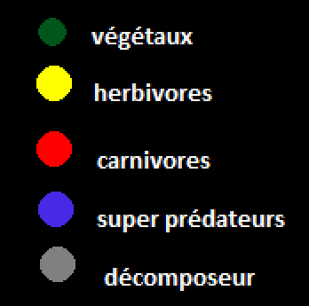
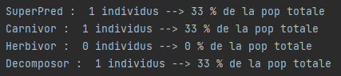
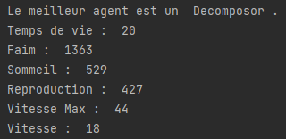

# TP2_Vivarium

Rouge : predateurs
Jaune : herbivores
Gris : Decomposeur 
Bleu : SuperPred

  

- [x] 1. (1 pts) Créer l’architecture SMA pour la mise en œuvre d’un vivarium contenant les éléments
précédent (une classe par fichier, un agent doit être pro-actif, avoir un body et un fustrum).

- [x]  2. (1 pts) Pour chaque élément, ajouter une méthode « show() » pour les afficher
distinctement. 
> Pour les couleurs :  
> 

- [x] 3. (2 pts) Ajouter, pour chaque body :
  - [x]   a. Une vitesse
  - [x]   b. Une vitesse max
  - [x]   c. Une accélération max
  - [x]   d. Une jauge de faim
  - [x]   e. Une jauge de fatigue
  - [x]   f. Une jauge de reproduction
  - [x]   g. Une date de naissance
  - [x]   h. Une espérance de vie
- [x] 4. (4 pts) Pour chaque body, ajouter une méthode « update() » faisant évoluer les paramètres précédents en fonction du temps.  
    - [x] a. Quand le body est trop vieux, l’agent meure
    - [x] b. Quand la jauge de fatigue est pleine, l’agent dort.
    - [x] c. Quand la jauge de faim est pleine, l’agent meure de faim
    - [x] d. Quand la jauge de reproduction est pleine, l’agent peut se dédoubler avec une modification aléatoire de ses paramètres.
    > la modification aléatoire de paramètres n'est pris en compte que pour les agents qui sont issus de reproduction, pas ceux issus de l'initalisation de la simulation
- [x] 5. (2 pts) Pour chaque agent, ajouter une méthode « filtrePerception() »
- [x] 6. (6 pts) Pour chaque agent, ajouter une méthode « update() » pour combiner les
comportements suivants :  
   - [x]  a. « Mangeur » : l’agent chasse
    > - Le **superprédateurs** mange les **carnivores** (pour permettre la symbiose superprédateurs-herbivores)
    > - les **carnivores** mangent les **herbivores**
    > - les **herbivores** mangent les **végétaux**
    > - les **décomposeurs** mangent tous les **agents morts** , y compris les décomposeurs morts  
    
   - [x] b. « Survie » : l’agent fuit un prédateur
    > - les **carnivores** fuient les **superprédateurs**
    > - les **herbivores** fuient les **carnivores**  

    - [x] c. « Symbiose » : l’agent utilise un autre agent pour se protéger
    > - si un **super prédateur** est dans son champ de vision et qu'il fuit un **carnivore**, un agent **herbivore** se dirigera vers le **super prédateur** pour qu'il le protège et mange le **carnivore**
- [x] 7. (2 pts) Modifier la méthode « update() » de la question 4 pour prendre en compte ses comportements.
- [x] 8. (3 pts) Ajouter un fichier scenario.json contenant les paramètres du vivarium (exemple ici :
https://pastebin.com/bDGhd0D9). Les intervalles [Min, Max] indique un paramètre aléatoire  
- [x] 9. (1 pts) Ajouter une fonction « load(path) » pour charger un scenario  
- [x] 10.  (1 pts) Afficher dans la console le pourcentage de la population  
> affichage est possible via un clique gauche

- [x] 11.  (1 pts) Afficher dans la console, l’individu ayant la meilleur génétique (plus grande vitesse max, plus grandes jauges, etc.)
> affichage est possible via un clique gauche  
  
- [x] 12.  (1 pts) Utiliser matplotlib et threading pour afficher un graphique en temps réel des populations.  
  

> Les paramètres ne sont pas assez bons pour quel le vivarium sont cohérents dans le temps
